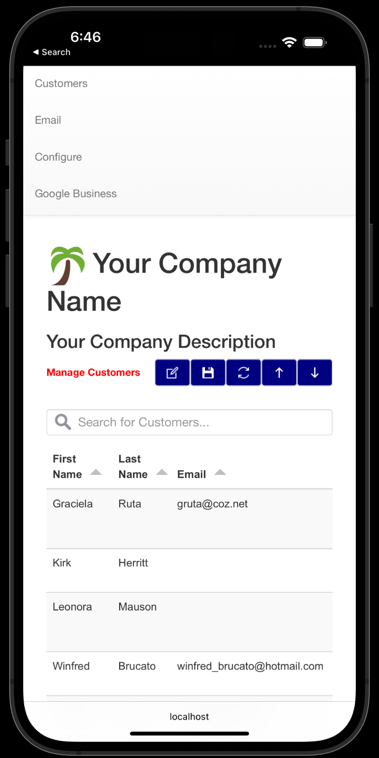
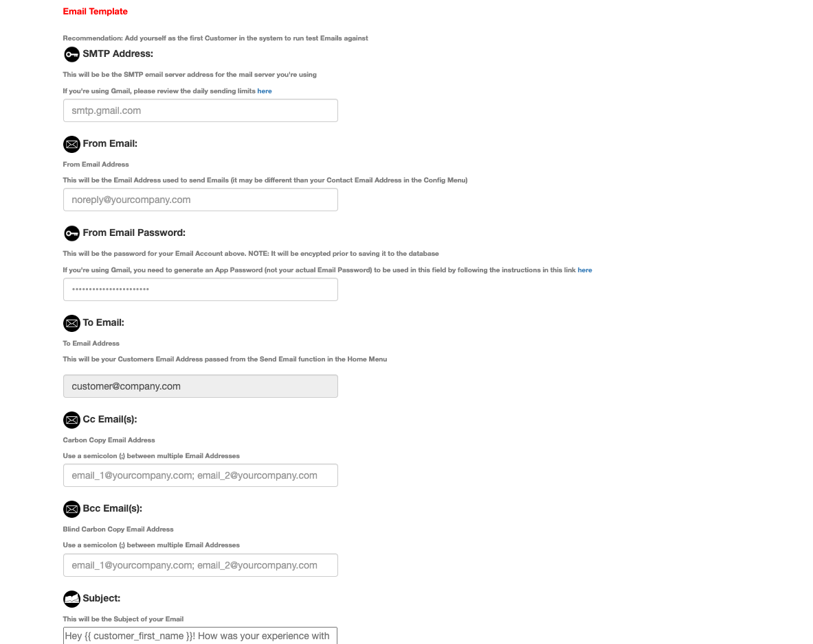
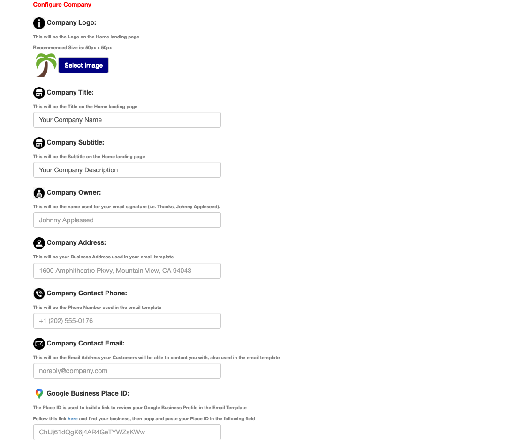
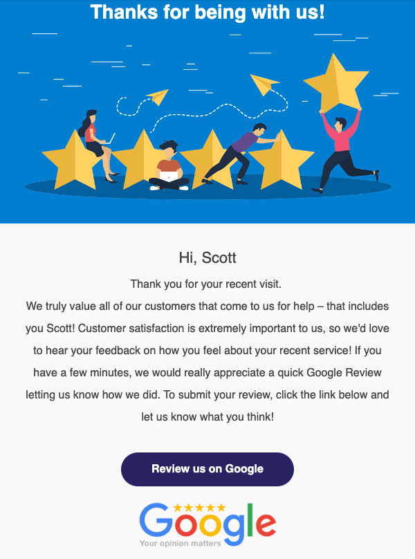

# Palm Tree

[](https://www.php.net/ChangeLog-8.php#8.1.6)
[](https://dev.mysql.com/doc/relnotes/mysql/8.0/en/news-8-0-31.html)
[](mailto:scott.grivner@gmail.com)
[](https://www.buymeacoffee.com/scottgriv)

------- 

**Palm Tree** is a web based CRM application with Google Business Review email request capabilities.

 * Keep track of your Customers in a digital format - ditch the pen and paper!
 * Send marketing emails out, including emails requesting Google Business Reviews!
    * Directly open a Review window on your Google Business page with a click of a button within the email.

-------

## Table of Contents

- [Fully Interactive Customer Table](#fully-interactive-customer-table)
- [Custom Email Template](#custom-email-template)
- [Configure Your Business](#configure-your-business)
- [Send Emails to Your Customers](#send-emails-to-your-customers)
- [Built Using](#built-using)
- [What's Inside?](#whats-inside)
- [Getting Started](#getting-started)
- [License](#license)
- [Credit](#credit)

-------

## Fully Interactive Customer Table


*Note: Data privacy is important to me, which is why the above data is fake data.*

* **CRUD-Enabled:**
    * Create Customers
    * Update Customers
    * Delete Customers
* Export table to a .csv file.
* Scroll up, down, and refresh the table easily using the provided buttons.
* Highlighted editable fields.
* Log Customer Notes.
* Sort Customers by:
    * First Name
    * Last Name
    * Email
    * Phone
    * Created Date
* Search for Customers based on:
    * First Name
    * Last Name
    * Email
    * Phone
* Check the **Send Email** box to send an email to the Customer.
* Mobile capabilities with Bootstrap:



## Custom Email Template



* Configure your Email Server to send Business emails using your own plain-text or HTML email template (Gmail Supported).
* Use variables from a predefined list to send curated emails to your Customers in the **Subject** and **Body**:

    ``Hello {{ customer_first_name }} {{ customer_last_name }}!``

    will translate to:

    ``Hello John Smith!``

* **CC** & **BCC** capabilities.
* Send a mass email to **ALL** of your customers at once.
* Create an account on **[imgur](https://imgur.com/)** to host photos used in your email template.

## Configure Your Business



* Upload and display your Company Logo.
* Display your Company Title.
* Display your Company Description.
* Add contact information to your emails using the predefined variables in your email template:
    * Company Owner
    * Company Address
    * Company Contact Phone
    * Company Contact Email
    * Google Place ID
        * Used to automatically open up Google Reviews for your business using the provided email template.
    * Social Media Email Hyperlinks:
        * Google, Facebook, Twitter, LinkedIn, Instagram, YouTube, Amazon, Pinterest, Etsy, and Shopify.

## Send Emails to Your Customers



## Built Using
* PHP v8.1.6
* jQuery v2.1.3 
* Bootstrap v3.3.5
* MySQL v8.0.31
* Docker v20.10.21 *(Recommended Deploy)*
* XAMPP v8.1.6 *(Alternative Deploy)*

## What's Inside?
A quick look at the top-level files and directories in this project.

    .
    ├── css
        ├── main.css
    ├── docs
        ├── images
    ├── img
        ├── config
        ├── fav
        ├── link
        ├── logo
            ├── default_logo.png
            ├── logo.png
    ├── js
        ├── jquery.tabledit.js
        ├── main.js
    ├── lib
        ├── PHPMailer-master
        ├── phpinfo.php
    ├── sql
        ├── config.ini
        ├── palm_tree.sql
    ├── templates
        ├── sample_email_template_no_logo.html
        ├── sample_email_template.html
    ├── .dockerignore
    ├── .gitattributes
    ├── .gitignore
    ├── about.txt
    ├── commands.php
    ├── configure.php
    ├── container.php
    ├── customers.php
    ├── database.php
    ├── docker-compose.yml
    ├── Dockerfile
    ├── email.php
    ├── footer.php
    ├── header.php
    ├── index.php
    ├── LICENSE
    ├── README.md
    ├── send_email.php
    ├── table_edit.php
    └── VERSION

1. **`/css`**: The directory where the default CSS file is stored: `main.css`.
2. **`/docs/images`**: Images used for the GitHub README relative path.
3. **`/img`**: Images used for the `customer.php` page.
    - **`/config`**: Images used for the `configure.php` page.
    - **`/fav`**: Favorite/Bookmark icons, including icons for Android and iOS shortcuts.
    - **`/link`**: Images used for the link icons on the `email.php` page (i.e google, facebook, etc.).
    - **`/logo`**: This is where your uploaded company logo will go from the Configure screen (replacing `logo.php`) for the Customer screen. There's also a backup of the default **Palm Tree** logo named `default_logo.php`.
4. **`/js`**: The directory where the default JavaScript and jQuery file is stored: `main.js`. It also contains the included dependency file [jQuery-Tabledit v1.2.3](https://github.com/markcell/jquery-tabledit), located in `jquery.tabledit.js`, used to update the Customer screen table using the `customers.php` table.
5. **`/lib`**: The directory where misc. library files are stored. This directory contains the [PHPMailer v6.7.1](https://github.com/PHPMailer/PHPMailer/tree/5.2-stable) dependency, which is used in the `email.php` file to call email functions. This directory also contains the `phpinfo.php` file, to be viewed in your browser, containing the `phpinfo()` function: 
> Because every system is setup differently, `phpinfo()` is commonly used to check configuration settings, such as log file locations, and for available predefined variables on a given system. 
6. **`/sql`**: This file  contains the configuration file, `config.ini`, used to connect to the database. It also contains the starting database script/structure, `palm_tree.sql`, required to run the application.
7. **`/templates`**: This directory contains two HTML files you can use as your default template in the email body located on the Email screen using the `email.php` file.
8. **`.dockerignore`**: The `.dockerignore` file is very similar to the .gitignore file in that it allows you to specify a list of files or directories that Docker is to ignore during the build process.
9. **`.gitattributes`**: The `.gitattributes` file allows you to specify the files and paths attributes that should be used by git when performing git actions, such as `git commit`, etc.
10. **`.gitignore`**: The `.gitignore` file tells git which files it should not track / not maintain a version history for.
11. **`about.txt`**: A brief reference to the applications author.
12. **`commands.php`**: A PHP file used to process requests and responses from the front-end application to the back-end database.
13. **`configure.php`**: The PHP file behind the Configure screen.
14. **`container.php`**: A PHP file used to create the HTML menu container (this sets the screen padding, size, etc. for each screen, making all the screens a consistent size).
15. **`customers.php`**: The PHP file behind the Customers screen.
16. **`database.php`**: The PHP file used to connect to the database configuration using the `config.ini` file.
17. **`docker-compose.yml`**: The Compose file used for defining services, networks, and volumes for a Docker application.
18. **`Dockerfile`**: A text document that contains all the commands a user could call on the command line to assemble a Docker image.
19. **`email.php`**: The PHP file behind the Email screen.
20. **`footer.php`**: The websites footer.
21. **`header.php`**: The website's header which also contains the path for favorite icons and remote JavaScript/CSS libraries.
22. **`index.php`**: The default landing page of the website which contains a redirect to `customers.php` (the Customers screen).
23. **`LICENSE`**: The application license file.
24. **`README.md`**: A text file containing useful reference information about this project (the file you're reading this from now).
25. **`send_email.php`**: A PHP file used to send emails out to customers.
26. **`table_edit.php`**: A PHP file used to connect the `jquery.tabledit.js` with the application.
27. **`VERSION`**: A file containing the current application version number.

## Getting Started

***Download the Application:***

1. Download **Palm Tree** using one of the methods below:
    - Download with **Git**:
    ```bash
        git clone https://github.com/scottgriv/palm-tree
    ```
    - Download with **Homebrew**:
    ```bash
        brew tap scottgriv/palm-tree https://github.com/scottgriv/Palm-Tree
    ```
    - Download the **Zip File** [Here](https://github.com/scottgriv/Palm-Tree/archive/refs/heads/main.zip).

***Using Docker (Recommended):***

2. Download **Docker** [Here](https://docs.docker.com/get-docker/).
3. Make sure **Docker** is up and running.
    - Make sure you follow the **System Requirements** under your preferred Operating System.
4. Launch your CLI (Command Prompt on Windows/Terminal on Mac).
4. Change the directory using your CLI to your **Palm Tree** directory:
    ```bash
        cd Desktop/Palm-Tree
    ```
5. Once you're in the **Palm Tree** directory, run the ```Docker Compose``` command (**NOTE:** this step may take a while to download all of the necessary images):
    ```bash
        docker-compose up
    ```
6. This will build the **Docker Containers** and you should find your application running under *port 80*.
    - Navigate to: ```http://localhost/index.php```

***Using XAMPP (Alternative):***

2. Download [XAMPP](https://www.apachefriends.org/download.html).
3. Start the `MySQL Database` and `Apache Web Server` services. Optionally, you can install these as a service if you're  using windows so the web server automatically starts and serves **Palm Tree** if the PC ever restarts or shuts down and comes back up:
    > First step to install Apache service, run XAMPP Control Panel as Administrator, then click the Apache service button located on the left side of Apache components, click next and “Click Yes to Install the Apache Service” window will open, then click Yes to continue.
4. Go to the `phpMyAdmin` portal and import the SQL database script `palm_tree.sql` located in the `sql` folder.
- **NOTE:** The below two changes are to correct the application from the default Docker install above.
5. Update the `sql/config.ini` file changing `db_host = db` to `db_host = localhost`.
6. Update the `container` class menu links in the `container.php` file From/To: 
     - From: `/customers.php` To: `/Palm-Tree/customers.php`
     - From: `/configure.php` To: `/Palm-Tree/configure.php`
     - From: `/email.php` To: `/Palm-Tree/email.php`
- Alternatively, you can update the `httpd.conf` file to set your default index page for your localhost to the `Palm-Tree` directory.

7. Go to your web browser and navigate to the URL: `http://localhost/Palm-Tree` and you should be redirected to the main application page.

***Closing:***

* You're ready to go! You should now be able to access **Palm Tree**.
* Feel free to use the provided email templates in the ``/templates`` directory under the **Email** menu, **Email Body**.
* **NOTE:** You may need to allow the *port* you're using to send your emails in your *Firewall Settings* (defined in the `send_email.php` file - default `port 465`). Ensure your anti-virus software is not blocking **Palm Tree** from sending out emails as well.

## License
**Palm Tree** is released under the GNU General Public License v3.0 License. [See LICENSE](LICENSE) for details.

## Credit
**Author:** Scott Grivner <br>
**Email:** scott.grivner@gmail.com <br>
**Website:** [scottgrivner.dev](https://www.scottgrivner.dev) <br>
**Reference:** [Main Branch](https://github.com/scottgriv/Palm-Tree) <br>
<div align="center">
    <a href="https://github.com/scottgriv/Palm-Tree" target="_blank">
        
    </a>
</div>