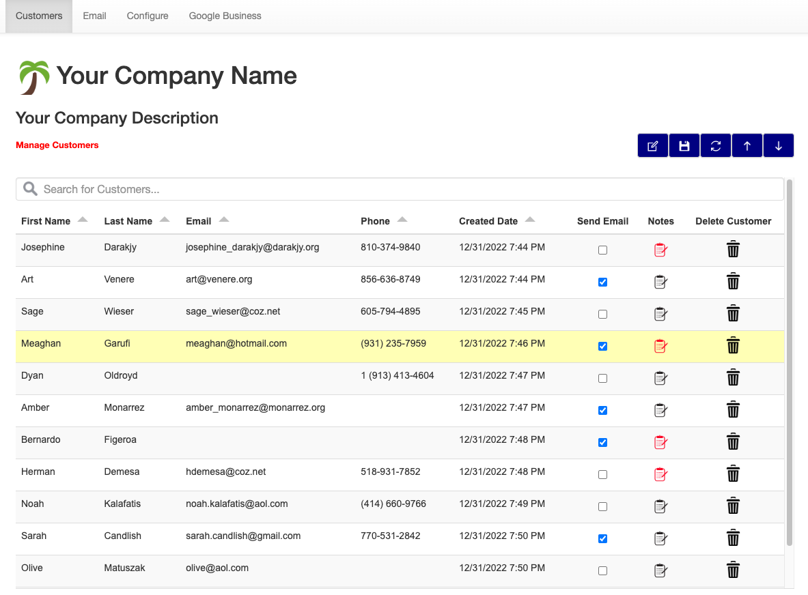
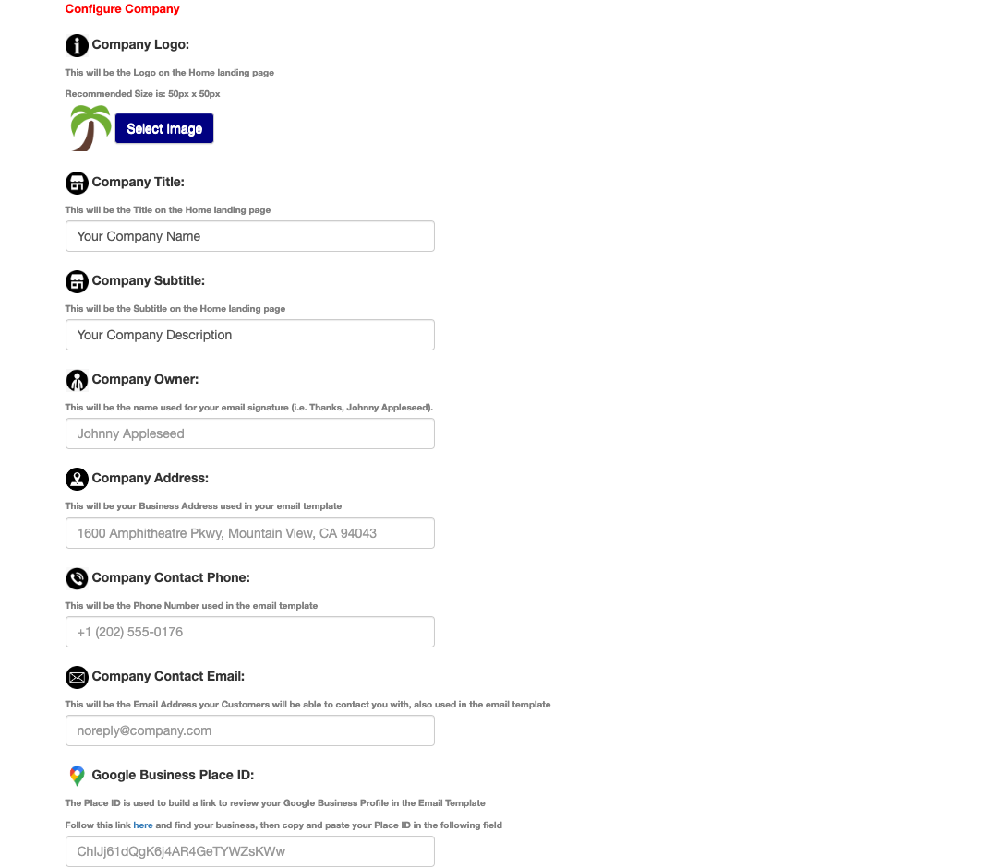

# Palm Tree

#

Palm Tree is a web based CRM application with Google Business Review email request capabilities.

 * Keep track of your Customers in a digital format - ditch the pen and paper!
 * Send marketing emails out, including emails requesting Google Business Reviews!
    * Directly open a Review window on your Google Business page with a click of a button within the email.

## Fully Interactive Table



*Note: Data privacy is important to me, which is why the above data is fake data.*

* **CRUD-enabled:**
    * Create Customers
    * Update Customers
    * Delete Customers
* Export table to a .csv file.
* Scroll up, down, and refresh the table easily using the provided buttons.
* Highlighted editable fields.
* Log Customer Notes.
* Sort Customers by:
    * First Name
    * Last Name
    * Email
    * Phone
    * Created Date
* Search for Customers based on:
    * First Name
    * Last Name
    * Email
    * Phone
* Check the **Send Email** box to send an email to the Customer.
* Mobile capabilties with Bootstrap.

## Custom Email Template


* Configure your Email Server to send Business emails using your own plain-text or HTML email template (Gmail Supported).
* Use variables from a predefined list to send curated emails to your Customers in the **Subject** and **Body**:

    ``Hello {{ customer_first_name }} {{ customer_last_name }}!``

    will translate to:

    ``Hello John Smith!``

* **CC** & **BCC** capabilties.
* Send a mass email to **ALL** of your customers at once.
* Create an account on **[imgur](https://imgur.com/)** to host photos used in your email template.

## Configure Your Business



* Upload and display your Company Logo.
* Display your Company Title.
* Display your Company Description.
* Add contact information to your emails using the pre-defined variables in your email template:
    * Company Owner
    * Company Address
    * Company Contact Phone
    * Company Contact Email
    * Google Place ID
        * Used to automatically open up Google Reviews for your business using the provided email template.
    * Social Media Email Hyperlinks:
        * Google, Facebook, Twitter, LinkedIn, Instagram, YouTube, Amazon, Pinterest, Etsy, and Shopify.

## Send Emails to your Customers


## Built using: 
* PHP v8.1.6
* jQuery v2.1.3 
* Bootstrap v3.3.5
* MySQL v8.0.31
* Docker v20.10.21
* XAMPP 8.1.6 *(Alternative to Docker - Download [Here](https://www.apachefriends.org/download.html))*

## Dependencies (Included): 

* [jQuery-Tabledit v1.2.3](https://github.com/markcell/jquery-tabledit)
* [PHPMailer v6.7.1](https://github.com/PHPMailer/PHPMailer/tree/5.2-stable)

## Quick Start *(Using Docker - Recommended)*
1. Download **Docker** [Here](https://docs.docker.com/get-docker/).
2. Download **Palm Tree**:
    - Download with **Git**:
    ```bash
        git clone https://github.com/scottgriv/palm-tree
    ```
    - Download with **Homebrew**:
    ```bash
        brew tap scottgriv/palm-tree https://github.com/scottgriv/Palm-Tree
    ```
    - Download the **Zip File** [Here](https://github.com/scottgriv/Palm-Tree/archive/refs/heads/main.zip).
3. Make sure **Docker** is up and running.
    - Make sure you follow the **System Requirements** under your preferred Operating System.
4. Launch your CLI (Command Prompt on Windows/Terminal on Mac).
4. Change the directory using your CLI to your **Palm Tree** directory:
    ```bash
        cd Desktop/Palm-Tree
    ```
5. Once you're in the **Palm Tree** directory, run the ```Docker Compose``` command (**NOTE:** this step may take a while to download all of the necessary images):
    ```bash
        docker-compose up
    ```
6. This will build the **Docker Containers** and you should find your application running under *port 80*.
    - Navigate to: ```http://localhost/index.php```

* You're ready to go! You should now be able to acccess **Palm Tree**.
* Feel free to use the provided email templates in the ``/templates`` directory under the **Email** menu, **Email Body**.

## License
**Pam Tree** is released under the MIT license. [See LICENSE](LICENSE) for details.

## Credit
**Author:** Scott Grivner <br>
**Email:** scott.grivner@gmail.com <br>
**Website:** [scottgrivner.dev](https://www.scottgriv.dev) <br>
**Reference:** [Main Branch](https://github.com/scottgriv/Palm-Tree)
